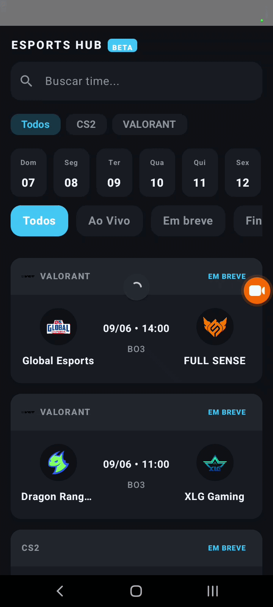

# 🎮 Esports Hub - Android Client

<div align="center">

### Your pocket portal for following eSports matches in real time.

[](LICENSE)
[](https://www.android.com/)
[](https://kotlinlang.org/)

<a href="https://github.com/FilipeLacerda738/EsportsNewsAppAndroid/releases/latest">
    
</a>

<br><br>



</div>

---

> 🚀 **Complete Ecosystem (Fullstack)**
> This application does not consume third-party APIs directly. It is powered by a **Custom Python Backend (FastAPI)** built to protect the app against request limits and deliver data in milliseconds.
> 🔗 [Explore the Backend Engineering here](https://github.com/FilipeLacerda738/esports-pro-api.git)

---

## 🎯 The Challenge and the Product

**Esports Hub** was created to solve a clear problem: most sports score applications are slow, cluttered, and consume too much mobile data.

This project was built using state-of-the-art native Android development technologies (**Jetpack Compose, MVVM, Coroutines**) to deliver a fluid, lightweight experience fully focused on user retention.

## ⚡ Engineering Highlights and Optimizations

* 📉 **App Size Optimization (From 90MB to 15MB):** Rigorous implementation of `R8/ProGuard` rules and `shrinkResources`. The final APK size was reduced by **more than 80%**, optimizing conversion rates without breaking Retrofit deserialization thanks to `@Keep` annotations.
* 🛡️ **Security and Leak Prevention:** “Blind” error handling inside the `ViewModel` layer. In case of network failures, the app intercepts OkHttp/Retrofit exceptions to ensure server IPs or API URLs are never exposed to the end user.
* 🎨 **"Gunmetal Gray" Design System:** Complete migration to a dark theme focused on dynamic readability and visual ergonomics, inspired by Strafe/HLTV.

---

## 🛠 Tech Stack

| UI Layer                               | Architecture & State            | Connectivity              |
| :------------------------------------- | :------------------------------ | :------------------------ |
| **Jetpack Compose** (Material 3)       | **MVVM** (Model-View-ViewModel) | **Retrofit 2** + Gson     |
| **Coil** (Async Image Loading & Cache) | **StateFlow** (Reactive State)  | **OkHttp** (Interceptors) |
| **Custom Components**                  | **Coroutines** (Concurrency)    | **Dynamic URL Injection** |

---

## 🗺️ Roadmap

The application is constantly evolving. Here are the next engineering and feature milestones:

* **[Current Phase] v1.4.0 (Fluidity & Retention):** Offline Cache implementation (Room Database) for instant startup and Infinite Scroll pagination for reduced mobile data consumption.
* **[Phase 2] Analytical Vision:** Match detail pages with individual map status (BO3), bracket tracking, and momentum graphs.
* **[Phase 3] Monetization & Engagement:** Real-time odds integration, affiliate dashboard for regulated betting platforms, and a Pick'em prediction system.

---

# ⚙️ Installation

## Prerequisites

* Android Studio Iguana+
* JDK 17
* Android SDK 26+

---

## 1. Clone the repository

```bash
git clone https://github.com/FilipeLacerda738/EsportsNewsAppAndroid.git
cd EsportsNewsAppAndroid
```

## 2. Configure your API KEY

Create a `local.properties` file in the project root:

```properties
API_ACCESS_KEY="your_access_key_here"
```

---

## 3. Run the project

* Open the project in Android Studio
* Wait for Gradle synchronization
* Click **Run 'app'**

---

# 🌐 Network Architecture

The application automatically switches between local and production environments using `BuildConfig.DEBUG`.

| Environment | URL                       |
| ----------- | ------------------------- |
| Debug       | `http://10.0.2.2:8000/`   |
| Release     | `https://yourDeploy.com/` |

---

All requests use header-based authentication:

```http
API_ACCESS_KEY: YOUR_API_KEY
```

---

# 🤝 Contributions

Contributions are very welcome.

## Contribution Flow

```bash
# Fork the project

# Create a branch
git checkout -b feature/my-feature

# Commit changes
git commit -m "feat: new feature"

# Push changes
git push origin feature/my-feature
```

After that, simply open a Pull Request 🚀

---

# 🗺 Roadmap

* [ ] Match details screen
* [ ] WebSocket integration
* [ ] Offline cache with Room
* [ ] Push notifications
* [ ] Favorites system
* [ ] AMOLED theme

---

# 📄 License

Distributed under the MIT License.

See `LICENSE` for more information.

---

<div align="center">

Built with ❤️ using Kotlin + Jetpack Compose

</div>
